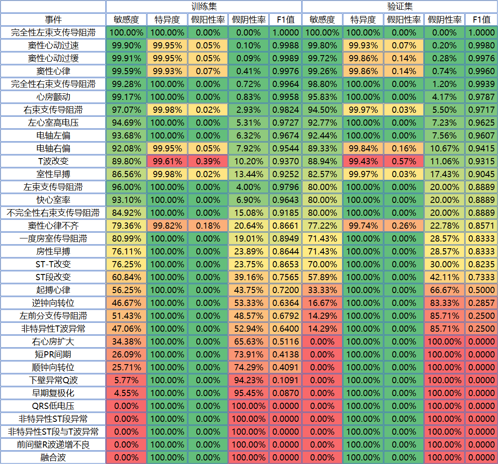

### “合肥高新杯”心电人机智能大赛 —— 心电异常事件预测 亚军(部分)方案

##### 致谢：

**hcb && 青禹小生 && JAVIS**

##### 链接：

赛题：

<https://tianchi.aliyun.com/competition/entrance/231754/introduction>

模型：

<https://scutmsc.club/hfecg/pretrained.tar.xz>

PPT：

<https://scutmsc.club/hfecg/otto.pptx>

##### 性能：

##### 备注：

这是我线下使用的方案，不是最终线上提交的方案，最终的方案是队长那个，见PPT
